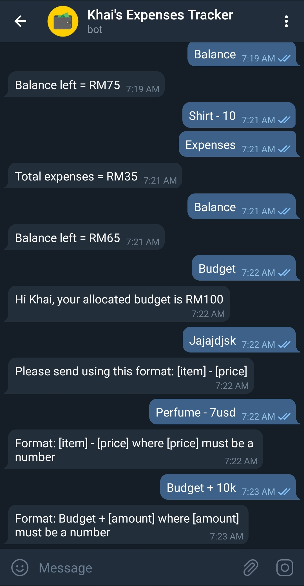

# Expenses Tracker Telegram Bot
Send your expenses to a telegram bot and it will automatically insert the data to your google spreadsheet.

**Chat examples:**

__Spreadsheet example:__

* Don't forget to select function setWebhook() and run in google script first.
* There are 4 things in the Code.gs that need to be replaced by you which is :
  * bot token
  * webApUrl
  * UserId
  * spreadsheet id.
* Make a spreadsheet just like the example photo given.
* Set "=Sum(C:C)" in cell B2 and "=B1-B2" in cell B3.

### 7 additional features that I have created so far.
1. Prevent other users who search for the bot @username from sending message to it. If not, anyone can write to our spreadsheet. The code will compare the id of the message sender with the owner UserId in the code.
2. Check if the [price] after "-" is number. If not, a string text can be entered to the spreadsheet.
3. Delete last inserted item/row.
4. Stop deleting row if there is no more item. If not stopped, the header will be deleted too.
5. Add the budget amount from telegram using "Budget + [amount]" where [amount] must be a number.
6. Can also use "Budget + -10" if you want to reduce 10 from the budget.
7. For "Budget + [amount]", check if the [amount] is a number, otherwise return an error message with encoded Url to pass the symbol +.
- [ ] Create new spreadsheet every month
